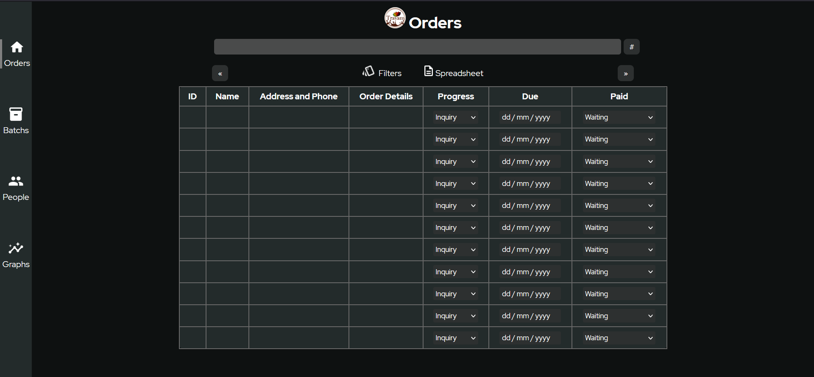

# 🔭 Brief Introduction
A software [in development] that helps in management of batchs, orders and contains grapghs to visualize data.
# Acknoledgements
- All icons used are from google- https://fonts.google.com/icons
# 🎯 Goal
- To create a electron application to run on a desktop, which will allow for sorting, viewing and editing of orders, customers, and batchs.
# 📈 Current status
- The HTML of the homepage is nearly finished, with its HTML and CSS complete
- Right now I am improving the dectection of change in the table of orders [in the home page] by JavaScript and the change in the images in the buttons on hover.

